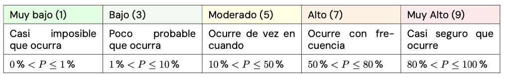
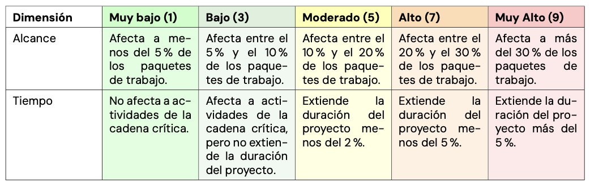
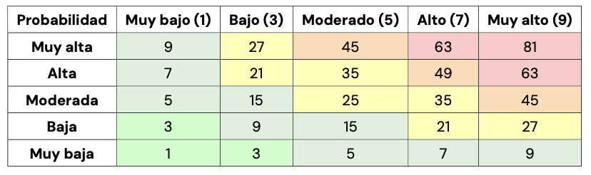
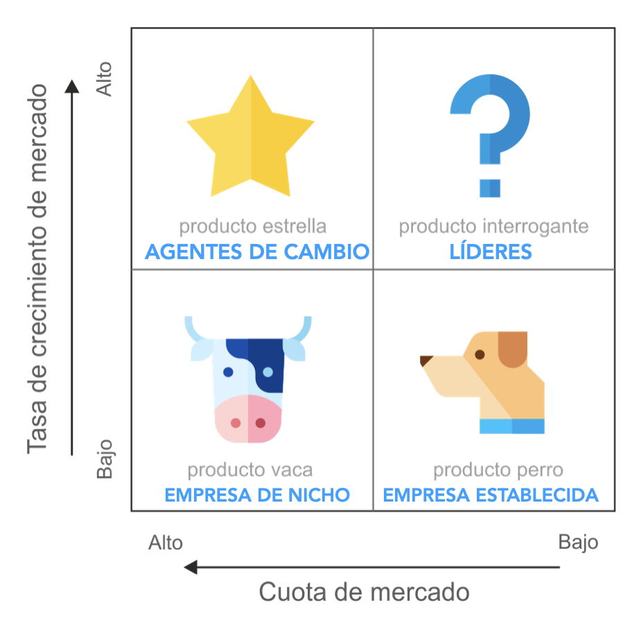
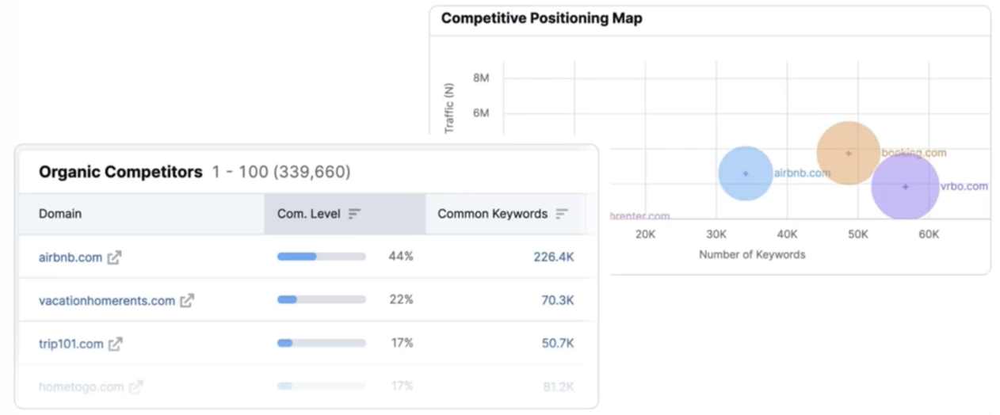
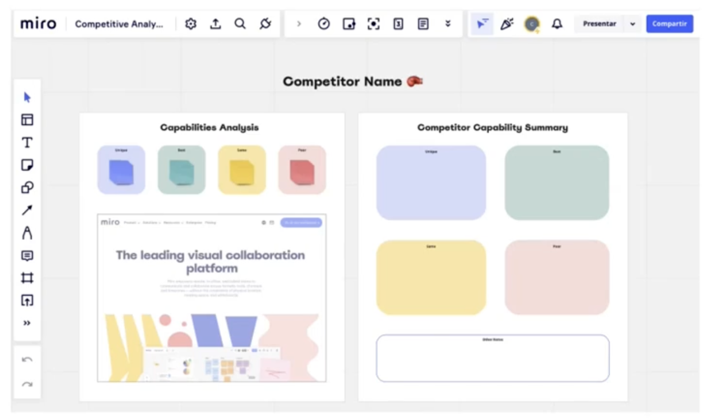
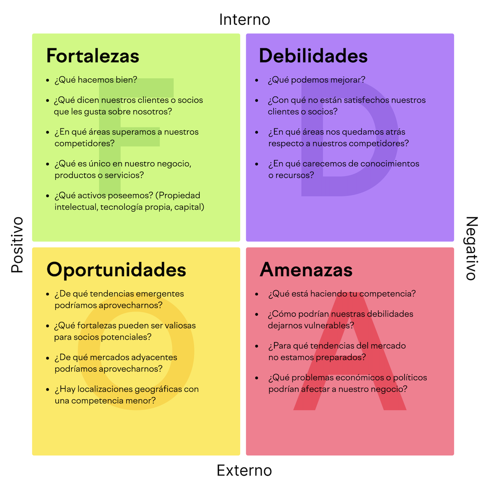

<!-- COMMENT THIS WHEN EXPORTING TO PDF -->

  

<h1 align="center" style={{ fontSize: "30px", fontWeight: "bold" }}>
  ISPP - PÍLDORA TEÓRICA 2
</h1>

---

**Ficha del documento**

- **Nombre del Proyecto:** FISIO FIND

- **Número de Grupo:** Grupo 6

- **Entregable:** #DP

- **Miembros del grupo:** Alberto Carmona Sicre, Antonio Macías Ferrera, Benjamín Ignacio Maureira Flores, Francisco Capote García, Daniel Alors Romero, Daniel Fernández Caballero, Daniel Ruiz López, Daniel Tortorici Bartús, Daniel Vela Camacho, Delfín Santana Rubio, Guadalupe Ridruejo Pineda, Julen Redondo Pacheco, Miguel Encina Martínez, Francisco Mateos Villarejo, Pablo Fernández Pérez, Ramón Gavira Sánchez, Rafael Pulido Cifuentes.

- **Autores:** Antonio Macías Ferrera

- **Fecha de Creación:** 17/02/2024

- **Versión:** v1.0

---

**Histórico de Modificaciones**

| Fecha      | Versión | Realizada por          | Descripción de los cambios                       |
| ---------- | ------- | ---------------------- | ------------------------------------------------ |
| 17/02/2025 | v1.0    | Antonio Macías Ferrera | Elaboración de la primera versión del documento. |

<!-- \newpage -->

## 1. GESTIÓN DE RIESGOS

La gestión de los riesgos siempre pasa por estas 4 fases: **IDENTIFICACIÓN / CLASIFICACIÓN, ANÁLISIS / PRIORIZACIÓN, MITIGACIÓN, MONITOREO**.

### Identificación / Clasificación

**Contenido del registro de incidencias**

- Tipo de incidente

- Descripción

- Prioridad

- Fecha de incidente

- Estado

- Solución

- Fecha de solución

**Factores que influyen en los riesgos**

- Grado de innovación tecnológica

- Baja productividad

- Cambio de requisitos

- Documentación deficiente

- Arquitectura del sistema no planificada

- Falta de compromiso

- Falta de pruebas del sistema

- Falta de comunicación

- Factor de bus

- Mala calidad del código

- Cuestiones presupuestarias

- Plazos agresivos

**Clasificación de riesgos (Ejemplo)**

- RIESGOS EN EL ALCANCE (RAL-000)

- RIESGOS EN EL CRONOGRAMA (RCR-000)

- RIESGOS EN LOS COSTES (RCO-000)

- RIESGOS DE CALIDAD (RCA-000)

- RIESGOS DE RECURSOS HUMANOS (RRH-000)

- RIESGOS DE COMUNICACIONES (RCM-000)

- RIESGOS EN LAS ADQUISICIONES (RAD-000)

- RIESGOS DE STAKEHOLDERS (RST-000)

### Análisis / priorización

**Definiciones de probabilidad**

**Definiciones de impacto**

**Matriz probabilidad x impacto**

### Mitigación

Elaboración de planes de contingencia: **EVITAR - MITIGAR - ACEPTAR**.

### Monitoreo

Ejecución del plan de contingencia → empleo de acciones correctivas → **monitoreo de las acciones correctivas**.

Se debe controlar que las acciones de mitigación de riesgos se están cumpliendo realmente, y reelaborar el plan de contingencia y/o aplicar nuevas acciones correctivas si fuera necesario

<!-- \newpage -->

## 2. GESTIÓN DE USUARIOS PILOTO

Un desempeño correcto de la gestión de los usuarios piloto debería contener:

1. **Selección _adecuada_ de los usuarios piloto**

2. Selección adecuada de **escenarios de prueba**

3. **Planificación** de pruebas

4. Buena **comunicación**

5. **Encuestas e _informes_** completos

6. Registro de **_feedback_** / **conclusiones**

**Sobre las encuestas**:

- **Preguntas _adecuadas_** (evita la complejidad)

- Establecer **medidas de éxito**: puntuación de 1 a 5, ⭐ ⭐ ⭐, 😁 😐 😡.

- Elaborar tendencias y **estadísticas** de puntuación de los usuarios piloto

- Definir objetivos **medibles**

- **_¡Hay que fomentar el pilotaje!_** El usuario debe sentirse escuchado, atendido y con ganas de seguir participando. Puede ser buena idea usar incentivos dentro de la aplicación.

### Pilot testing vs Beta testing

|               | Pruebas piloto                                           | Pruebas beta                                                      |
| ------------- | -------------------------------------------------------- | ----------------------------------------------------------------- |
| **Hecho por** | Grupo seleccionado de usuarios (Público objetivo)        | Usuarios finales                                                  |
| **Requiere**  | Solo el entorno de desarrollo                            | El entorno real                                                   |
| **Hecho**     | Antes del despliegue en producción                       | Después de la implementación en producción                        |
| **Realizado** | En el componente del sistema o en el sistema completo    | En el sistema completo                                            |
| **Para**      | Verificar la preparación del producto para el despliegue | Para minimizar el riesgo de fallo del producto completo y "final" |

<!-- \newpage -->

## 3. ANÁLISIS DE COMPETIDORES

Un **análisis de competidores** es el proceso de identificación de competidores en un mercado y evaluarlos frente a un conjunto de negocios predeterminados.

El **objetivo** es superar a los competidores que tienen objetivos similares a los nuestros, y ofrecer un servicio diferencial

### Tipos de competencia

- 🥊 **_Competencia a nivel empresarial_**: Productos o servicios similares, Tamaño y comunidad similares.

- 🤩 **_Competencia aspiracional_**: Marca muy superior. Comunidad muy superior.

- 🔑 **_Competencia de palabras clave_**: Palabras clave relacionadas con el mismo modelo de negocio.

### Identificación de competidores

Identificar **audiencia objetiva** → buscar palabras clave y búsqueda en redes sociales.

Herramientas para la búsqueda de competidores: [Semrush](https://es.semrush.com/).

**Cuadrante de crecimiento**

Muestra el ritmo al que competidores similares crecen en el mercado.

**Mapa de posicionamiento**

Relación entre número de palabras clave comunes vs tráfico.

### Búsqueda de competidores (4Ps)

📦 Producto

- ¿Cuál es su **_producto_** o servicio más popular?

- ¿Qué **_características_** ofrece el producto?

- ¿Quién es el **_público objetivo_** de este producto?

- ¿Qué **_problema_** resuelve este producto?

📍 Lugar

- ¿**_Dónde compra su público_** objetivo?

- ¿Qué **_canales de distribución_** deberías usar para llegar a tu audiencia?

💰 Precios

- ¿**_Cómo se alinean los precios_** de los productos de su competidor **_con productos comparables_**?

- ¿Tienen **_rebajas_** frecuentes, descuentos u otras ofertas especiales?

📣 Promoción

- ¿Cuál de los canales promocionales de su competidor funciona mejor?

- ¿El mensaje de su marca resuena con su público objetivo?

Herramientas: [Metricool](https://metricool.com/es/), [SimilarWeb](https://www.similarweb.com/), [ahrefs](https://ahrefs.com/es/site-explorer).

### Elaborar perfil de competidores

### Matriz DAFO

### Errores comunes

- No saber quiénes son **_todos los competidores_** o solo elegir a uno.

- No hacer investigación de **_palabras clave_** o monitorear el rango de búsqueda de Google.

- No seguir las **_noticias_** de la industria o mantenerse al día con las tendencias de la industria.

- No monitorear las noticias o **_publicaciones de blog_** para las menciones de los competidores.

- No reconocer **lo que sus competidores están haciendo bien**.

- **_Solo lo hacen una vez_** y ocasionalmente revisar y actualizar.

- **_Solo compartirlo con unos pocos_**.

<!-- \newpage -->

## 4. PRESENTACIONES EFECTIVAS

### Errores comunes

- Miedo a hablar en público

- No mantener la atención de la audiencia

- No saber qué contenido, y cuánto, colocar en las diapositivas

- Incomodidad incorporando lenguaje no verbal

### Tips ;)

- Inicio efectivo

- Contar una historia

- Sonreír y mirar al público a los ojos

- Mostrar pasión

- Cuidar la presencia

- Practicar

- Respirar :D

- Regla 10-20-30

